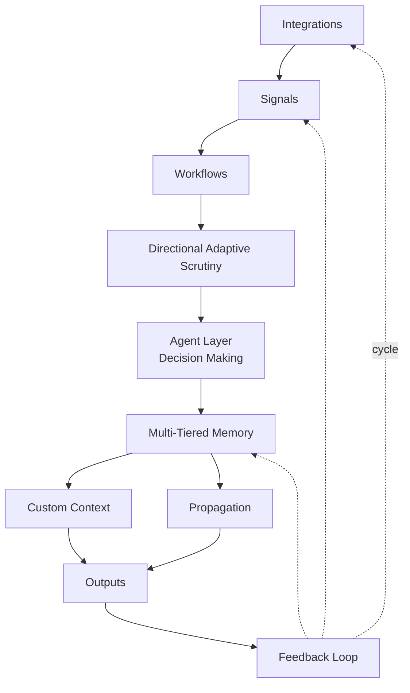
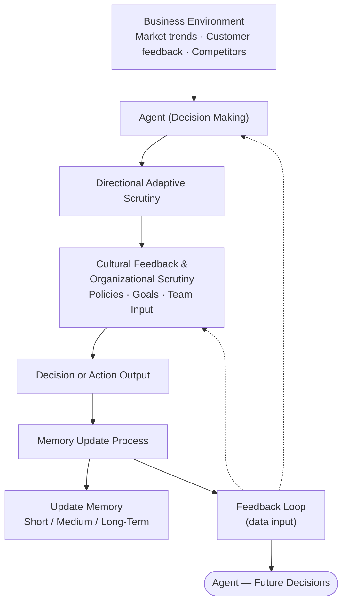
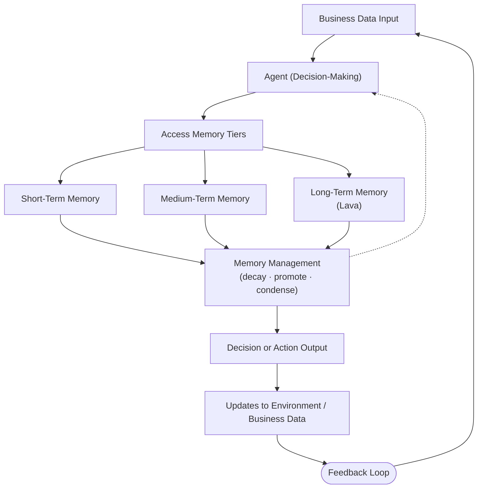
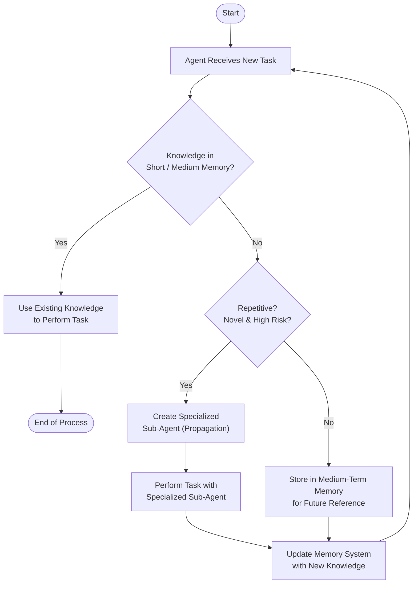

# OpenAGI Thesis

**Scrutiny, Memory, and Propagation — three things a system needs before it's an agent.**

> This document is the thinking behind OpenAGI. It's a personal essay, not a research paper. If you want the install instructions and feature list, see the [README](README.md). If you want to know *why* the codebase looks the way it does, read on.

---

## The premise

OpenAI's innovation — more or less, transformers at scale — is a very strong prediction and reasoning machine. But they haven't built AGI. It's fair to say that a strong prediction and reasoning machine, getting better and better alone, will not create AGI.

If you define AGI as the ability to perform emergent tasks *and* the ability to interact with the world independently of intervention by other intelligence, I don't think greater reasoning and predicting alone will get us there.

My oversimplification is that there are three things a system needs:

1. **Directional Adaptive Scrutiny**
2. **Memory**
3. **Propagation**

---

## 1. Directional Adaptive Scrutiny

When I was a kid, I remember thinking really hard about what needs to happen to create intelligence that is emergent. How do you get an atom to attract more atoms, bacteria to work together, and of course cognitions to create emergent behavior?

I thought the best question was: why don't other things become dramatically more intelligent, the way humans do? Why don't all animals become super-intelligent eventually? If they all have the same biological resources, why did only a few make it? (Let's assume there were a few humanoid species that made it — *Homo sapiens* were just the most violent.)

I was also curious why specific cultures and geographies had greater inventiveness relative to the same species in different cultures and geographies.

Whether it was geography or culture dictating outcomes, there was a common factor: **the environment something exists in dictates its ability to adapt and its social scrutiny.** Too harsh and it withers and dies; too easy and it has no evolutionary incentive to get better.

You see this with cultures near the equator with near-perfect weather, relative to cultures with extreme climates. Inventiveness and new emergent behavior weren't a nice-to-have but a matter of survival. And it wasn't just that the climates were more extreme — it's that they were **cyclical (partially predictable), diverse, *and* extreme.** Predictability matters: a culture can only get as advanced as its ability to advance *between* unpredictable resetting events.

There are extreme weather events near the equator too, but they're far from something you can plan around. Hurricanes, monsoons — these reset innovation.

(There's more about this in *Guns, Germs, and Steel*, which I haven't read but have heard talks much about this topic.)

Environment can be summed up as a form of scrutiny. Effectively dictating, *"adapt or die,"* giving real-time feedback like *"no, that won't work here"* and *"yes, that will help you survive."*

The second variable in geographic inventiveness is **cultural scrutiny.** Humans have a very unique mating criteria, in that it is dynamic, ever-changing, and never consistent.

Other species evolve unique mating characteristics if the selection increases their chance to survive via propagation over longevity. But it's slow, often caused by random mutation.

Humans have this weird thing where if you asked 100 women and 100 men in 100 different geographies over the course of 1,000 years to rank their attraction to 200 of the opposite gender, there wouldn't be consensus. One era found overweight individuals a sign of wealth, another a sign of poverty; some found certain tattoos a sign of *X*, others of *Y*. Attraction isn't clear-cut even among small groups with similar social, economic, and geographic backgrounds.

So scrutiny isn't just *"this is objectively good, this is objectively bad."* It's **dynamic scrutiny that's ever-changing, never consistent, but predictable.**

In ML we already understand this — it's effectively what reinforcement learning does. You tell it yes or no on a slew of data. The problem is that these are static models. You do a bunch of stuff, then you pull it back, retrain, then go back out.

Reinforcement learning is a form of scrutiny, but it is monolithic, without emergent behavior itself. It scrutinizes for one specific objective, often labeling data as good or bad output. This is fine in a static system trying to solve one problem with one set of data and one clear right answer. So while it's predictable in a psychological sense (it makes rational decisions — a chicken won't randomly be classified as a fruit), it lacks diversity and extreme polarization.

An ideal scrutinizer is one that:

- has a clear direction but not a clear outcome,
- is predictable in its thinking and logic,
- has strong diversity in what it can scrutinize,
- and can have conflicting and polarizing scrutiny.

That creates a chicken-and-egg: which comes first, the scrutinizer or the scrutinized?

I would argue GPT-4-class models (and successors) are capable of this with recursive evaluation, which is much of what current agent frameworks already attempt.

---

## 2. Memory

One emergent quality of intelligence is its ability to react to a new situation fast, learn from it, then never make that mistake again. Today, with modern LLMs, it can be months or even years before this behavior changes.

LLM memory and ability to adapt is archaic; akin to every time you wanted to learn a new skill in your life, you had to birth another kid, teach it the skill, then kill yourself. A species wouldn't last more than a generation.

A system can't just adapt to scrutiny — it has to store the behavior in three core variants of memory:

- **Short-term memory (RAM).** What you need to know right now to survive (catch, move, talk).
- **Medium-term memory.** What you need to know on a day-to-day basis to survive (kill, eat, bathe, socialize).
- **Long-term memory.** What you need to know over a lifetime to survive (reflexes and intuition).

I call the long-term storage **"Lava."** It's the things we know to be true but don't have direct experience with, and have an intuition on how to interact with — like lava itself. I've never seen it, touched it, or smelled it, but I've seen a photo and I know not to touch it.

A system needs to store these types of memory and retrieve from them at different fidelities. We often reason about long-term memory from a place of feeling, not logic; medium-term from explicit recall; and RAM is often the most rationalized (not always rational).

This is the easiest of the three to implement — it's a fairly solved problem in ML. Most LLMs only really work on RAM and long-term memory, and they're missing the system that *manages* this memory effectively.

If I told an LLM "I am Spencer" and then started a new chat, it wouldn't know who I am. It can have short-term memory, but it fails at determining what it should remember, what it shouldn't, how readily available that information should be, and what fidelity it needs.

It can't just be good enough to remember "spiders are bad." An hourglass on a spider will kill you. The specificity of the knowledge may be more critical than the general understanding itself.

It's imperative that a system learn how to **compress knowledge** — not just for speed but for evolution. Perfect memory is a curse, not a gift. Our ability to forget and retry in future generations without the burden of direct memory is what allows progress.

This sounds like a bug, not a feature — surely we could fix the bug *and* keep the feature? I disagree. A system that is rational should use its memory to predict outcomes; determining when its memory should *not* be considered would require its own fractal of decision-making that paralyzes the system. The "burden of knowledge."

The world is predictable if only you have perfect understanding. If a system understood how every atom interacts with every other, the world would be self-deterministic with a static outcome. But for a system to understand the system it works in, it would have to be more complex than the system it observes — meaning it would simply memory-overflow on any decision.

Building in **limited fidelity** lets a system make fast decisions that are accurate, learn, adapt, and improve — accurate but not precise.

---

## 3. Propagation

This one is my most recent addition, and I debated heavily whether it was essential.

I think the answer is: *yes, but not in the way it's usually framed.* If you define propagation as **multiplication** — replication 1:1 with the original entity — I don't think it's just unnecessary, I think it's actively destructive. Multiplication is cancerous. It creates more of itself without improvement. It will kill the system it exists in by flooding it with ever-decreasing productivity, because it can't adapt or specialize through division.

I would rather define propagation as **specialization through division, not multiplication.**

We think of propagation as a means that creates complexity — but that doesn't make sense. No system *asks* to become more complex. Complexity is a by-product of bad division.

Look at social systems. We have hierarchy and divisions of labor. Inventiveness is often viewed as our ability to specialize a division of labor. *Innovation*, in my view, is when you've **removed or changed** an existing workflow — not just simplified or improved it.

The goal isn't to create more to do by maintaining a more complex system. The goal is to simplify systems by dividing generalized knowledge. The more we propagate specialization, the more efficient a system runs, and the more its specializations exceed the capabilities prior to division.

Whether you look at social systems like a company, or cognitive systems like synapses, the goal is to specialize repetitive tasks. We create specialized parts of our brain that do specific work; we hire people for specialized tasks; we create companies for specialized tasks. Much of what we learn over time is that when we spread generalized understanding too thin across specialized tasks, the system collapses from inefficiency.

If a system can only propagate by *multiplying*, it will end up overly generalized, unable to do any one thing well, and therefore not very useful.

---

## Putting these pieces together

> *As I write this, I notice the similarities to Buddhism, and the idea that "we live in hell and heaven, you choose." Ideologies that have existed for thousands of years. I think that similarity only validates an accepted observation of reality — just through the lens of using that wisdom for our own evolution. We're all just a remix.*

The questions that remain:

- How do we build a system that scrutinizes well?
- How does the system determine what to remember and how to remember it?
- How does the system decide when to propagate?

### How do we build a system that scrutinizes well?

The easiest way to visualize putting these together is a family unit.

The individual with selection power scrutinizes their options (mating). Optimizing for cultural and environmental factors, they create a division of themselves to *"be better than they were"* at a specific aspect of life they couldn't achieve on their own.

The individual then scrutinizes the creation to do that specific thing better — otherwise they risk multiplication, which is cancer that just creates complexity.

The objective the system scrutinizes towards should be predictable, rational, and extreme. It should not be *"answer the meaning of life"* or *"be a helpful assistant."* It should be a self-maintaining scrutinizing system, where its own scrutiny is emergent to the task it's asked to do.

Giving too much direction here would be like reading a book on "how to raise your kids" and assuming there's a thing called *"kid"* that can be *"raised"* in one singular way. However much parents wish that were true, it isn't.

What this means in practice: I tell a system *"I want to design a website,"* and it thinks, *"do I know how to do this? what questions do I need to ask to understand what I need to do?"* This is most of the recent work on LLM agents — looping question-and-answer to improve output.

There are many imperfections in current agents, but most of these are *appendages* — physical limits in their ability to interact with computers, the internet, and the real world.

The real alteration past giving them better tools is: once it's decided what to do next, how should it remember that decision? What situational information does it need to retain to determine what to do *next* time? I think this can be done fairly simply through prompt design.

### How does the system determine what to remember?

The thing that gets created (the division) has to remember as much of this scrutiny as it can, or it risks not adapting to an emergent environment — and either dies, or repeats the system's suffering.

In remembering, it has to decide: *"do I need to specialize in something to accomplish this goal again, or am I capable of doing this without new specialization?"*

We see this in ourselves. Many of us know the feeling of *"going on autopilot"* — the brain has specialized a task through repetition so well that it doesn't need to be cognizant of its actions to perform it.

> *Side note: if a human can autopilot a task today, AI is likely going to be able to autopilot it in the near future.*

If a system reasons that this is a relative task it will need to do many times, it will need to create a division of itself that gets scrutinized down to performing that specific action better than the main system. The main system will effectively go on autopilot when engaging with that new division.

This is supported by recent developments in psychotherapy — the metaphorical *"parts"* expressed in IFS (Internal Family Systems), one of the more recent and well-accepted forms of therapy. I think the *"parts"* metaphor is less of a metaphor and more of a real interaction with the individual specializations we've built (consciously or not) to handle specific problems in our environment.

Effectively, we get logically predictable, diverse, and extreme scrutiny from both our environment and from each other (often our parents). We then determine if we can accomplish a task on our own, or if we need to create a new system that specializes in it.

One of our flaws as humans is the inability to interact with our subconscious directly. Meditation, in theory, allows this interaction. Much of therapy attempts to communicate with this internal wiring. I think our inability to directly influence this system out of the gate isn't a bug — it's a feature, like how we aren't born knowing a language but are born with the ability to *learn* one.

Language is a filter for the world. We understand things through the words we have to describe them. So being born with knowledge inherently creates an initial bias. What we see with language is our ability to merge and create new words, especially in new generations. New words to describe new feelings create generations more in touch with those feelings.

Knowing this, it's important for a system to decide what it stores in long-term memory (memory that gets passed down). For us, today, it's up to the individual to decide what they store in short, medium, and long-term memory.

I'd argue we should follow the same system humans do: store **repetitive or novel** information. We remember not to touch hot stoves *and* our phone numbers. Not much in between.

We're very good at condensing information. If you take anything out of this essay, you'll likely remember three things:

1. Scrutiny
2. Memory
3. Propagation

More acutely, you'll probably remember *propagation* — it's the most novel word and the most interesting thought experiment.

I think a system with these three foundational blocks will be self-improving.

### How does the system decide when to propagate?

This is the most complex part to implement, but if the other two do their job well, this shouldn't be a difficult decision.

We typically specialize when a task becomes **repetitive, or novel-but-high-risk.** Think of driving and taking the SAT. We drive every day, so we should create a specialized agent. We take the SAT once and the cost of failing it is high, so we specialize for it.

The technical difficulty here is the **fractal nature** of the system. It's effectively a meta-neural network — spinning up self-replicating agents to specialize on specific tasks. LLMs are difficult enough to run resource-wise when there's just one. The way to manage this is to build new agents as **tools the main system spins up only when needed.**

Our brain works similarly. The "we only use 10% of our brain" myth started because at any given moment we don't utilize more than ~10% — we'd want to run a similar system. Effectively running a neural net on the neural net. A semantic network where these specialized systems can be found and run on-demand.

Concretely: the system first determines if it should look through short, medium, or long-term memory to see if it already contains the knowledge needed. If the knowledge is in short or medium memory, no new agent needed.

If the knowledge isn't readily available, it's either in long-term memory or it needs to create a new agent specialized for the task. If it spawns one, it generates a specific prompt that addresses what the new agent needs to know, and provides relevant tools.

Ideally these systems would continuously optimize themselves, propagating to more and more specialized tasks. We first learned physics, and then specialized into hundreds of fields of physics, while the rest of nature kept going. In the same way, ideally, specialized agents can continue to self-propagate.

In theory, they wouldn't even need to know they're being used by a larger system to accomplish another goal.

A way to think about this: we could be a simulation built to figure out a specific outcome for a much more intelligent species. We exist only to serve one singular output. While we may never be shut off, our job is to optimize for a specific outcome — maybe that's *"the selfish gene,"* maybe it's a social experiment. Who knows. But the system would create micro-simulations of specific roles to accomplish goals.

This could be personified into a village where individuals represent LLM agents, and those LLM agents represent individual neural networks.

I think the system will figure this part out.

---

## The system, in pictures

### The whole pipeline

Every signal that enters the runtime travels this loop. Each box is a real file in `src/`.

### How a decision gets made

Each decision passes through scrutiny + organizational feedback. In OpenAGI, the "Cultural / Organizational" layer runs **asynchronously** — outcomes are recorded, and a weekly LLM-as-judge nudges scrutiny weights based on what worked. (A future iteration could make this synchronous, gating each decision on org policy.)

### How memory tiers are accessed

Every retrieve hits all three tiers in parallel and the memory manager handles decay, promotion, and condensation in the background.

### When a specialist gets spawned

Propagation only fires when the system both fails to find existing knowledge **and** judges the task as repetitive or novel-but-high-risk. Multiplication is cancer; division is the goal. Thresholds (configurable in `propagation-controller.js`): repetition ≥ 0.72, or risk × novelty ≥ 0.62.

---

## Why this matters for OpenAGI

These three concepts are why OpenAGI exists, and why the codebase is structured the way it is:

| Concept | Where it lives in code | What it does |
|---------|------------------------|--------------|
| **Directional Adaptive Scrutiny** | `src/directional-adaptive-scrutiny.js` | Seven-axis signal evaluation (`urgency / impact / novelty / repetition / risk / confidence / specificity`). Decides `act / ask / watch / ignore / propagate`. |
| **Memory (Tiered)** | `src/memory-system.js` + `file-backed-memory-store.js` | Short-term working context, medium-term repeated patterns, long-term **Lava** for durable truths. Decay + promotion. Condenser distills repeated raw items into principles. |
| **Propagation** | `src/propagation-controller.js` + `src/agent-store.js` | Bounded specialist creation when patterns repeat or risk is high. Each specialist gets its own scope, memory, and tools — division, not multiplication. Quality loop retires specialists that don't earn their keep. |

The proactive behavior — the agent reaching out before you ask — is the **outcome** of these three working together. The agent is scrutinizing your activity, storing what it sees in tiered memory, and propagating specialists to handle recurring intents. Once those three loops are running, "reaching out first" isn't a feature you bolt on; it's what falls out.

If you want to read the code paths that implement this, start at [`src/abi-runtime.js`](src/abi-runtime.js) — that's the entry point that wires Scrutiny → Memory → Propagation together for every signal that comes in.

---

[Back to the README](README.md) · [openagi.sh](https://openagi.sh) · [github.com/Spshulem/openAGI](https://github.com/Spshulem/openAGI)
